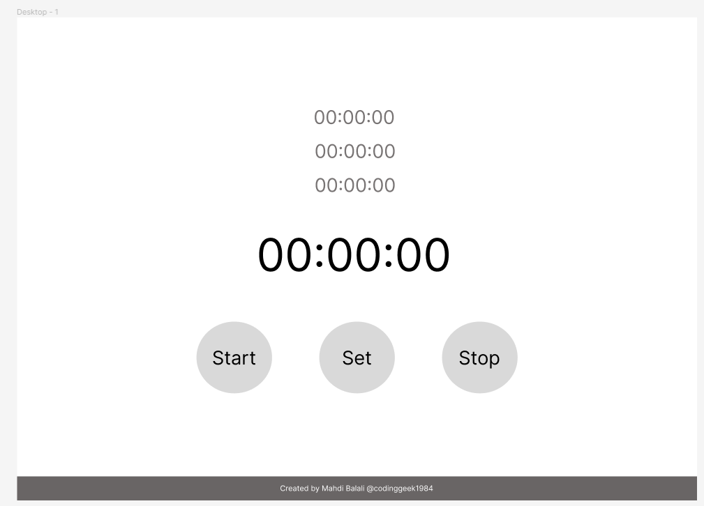
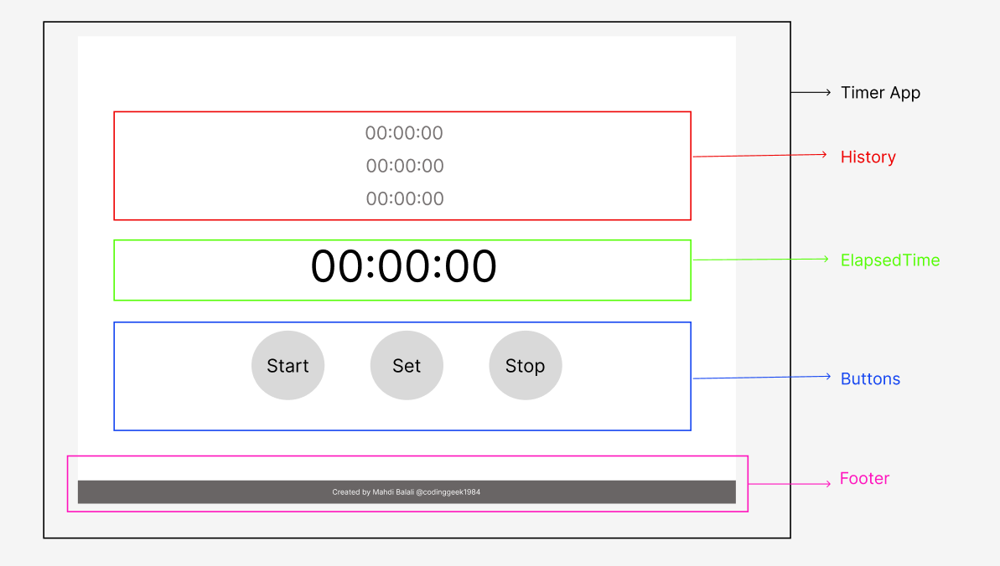

# Timer/Stopwatch

## Introduction
My goal by developing this program is to improve my skills and mastering in React. The idea is from the weblog article 
"50+ Beginner and Intermediate level React Project Ideas" by R. Fulzele published at [Medium](https://medium.com/). You can find the paper [here](https://medium.com/@rohan.fulzele/50-beginner-and-intermediate-level-react-project-ideas-%EF%B8%8F-809b396faa39).
The program description is very simple:

> 8. Timer/Stopwatch: Build a timer or stopwatch application with start, pause, and reset functionalities.

I will keep it simple, as it is, to concentrate more on React implementation. I will also track the famous article published by React Official, [**Thinking in React**. ](https://react.dev/learn/thinking-in-react). Actually, the project plan is designed just the same as the steps provided in this paper.

## Project Plan
1. Create wireframe in figma
2. Break the UI into a component hierarchy
3. Build a static version in React
4. Find the minimal but complete representation of UI state
5. Identify where your state should live
6. Add inverse data flow
7. Make it Responsive
8. Test
9. Publish

## Project Wire-frame:
I have create a very simple wireframe for my timer app. you can see it designed for desktop and small android cell phone in the following images:

Figma files could be reached [here](https://www.figma.com/file/QgB6OT2J9yRcuBmqvFKQQo/Untitled?type=design&node-id=41-94&mode=design&t=lbMpTMJD4dkXmyVF-0).

## Break the UI into a component hierarchy
I just breaked down the UI which I just designed in Figma, to components, based on their rolte in the program. The schematic is provided in the following image:

The five components designed, are as follows:
1. Timer App, contains the entire App.
2. History, shows the set times
3. Elapsed time, is the main section of the UI, showing the elapsed time since the user clicked start.
4. Buttons, includes the buttons of the app, and will manage their functionality.
5. Footer is a static section, showing the copyright details of the app.

## Build a static version in React
Now, according to the [Thinking in React](https://react.dev/learn/thinking-in-react) paper, I will create a static version of the app, including the mentioned components in the previous section.
In this section, I will first create the components in the layout, without any style. Then I will update the CSS file and make them look the same as my wire-frame.

## Find the minimal but complete representation of UI state
For this section I will go through the notes in the [ref. paper](https://react.dev/learn/thinking-in-react):

> Think of state as the minimal set of changing data that your app needs to remember

> Now think of all of the pieces of data in this application:

My app needs to remember these data and status:
1. the history of set times
2. The elapsed time
3. The app status, wheter it is working, or stoped.
4. timerID which is the 

> Which of these are state? Identify the ones that are not:
>> Does it remain unchanged over time? If so, it isn’t state.
>> Is it passed in from a parent via props? If so, it isn’t state.
>> Can you compute it based on existing state or props in your component? If so, it definitely isn’t state!

The answer of these questions for my parmeters:
1. The history of set times will change over time. it is not passed in as props. And we can not compute it based on the existing state or props in other components. So, this is a **State**. We will call it **historyArr**
2. Altough the elapsed time, is eligible for all conditions of being state, but it could be assmed as the last item of history. so I will not define a seperate state variable for this parameter.
3. The app status will change over time, based on user actions. This status is not passes via a props, and can not be computed from any other status. so it is also a **State**. We will call it **appStatus**.

## Identify where your state should live
Our ref. paper suggest three steps for deciding about where the state should live:
>1. Identify every component that renders something based on that state.
>2. Find their closest common parent component—a component above them all in the hierarchy.
>3. Decide where the state should live: 
>&nbsp;3.1. Often, you can put the state directly into their common parent. 
>&nbsp;3.2. You can also put the state into some component above their common parent. 
>&nbsp;3.3. If you can’t find a component where it makes sense to own the state, create a new component solely for holding the state and add it somewhere in the hierarchy above the common parent component.

Now, for our case it will be: 
A. **historyArr**
1. The components that render something based on the state are:
   1. History
   2. ElapsedTime
2. Their closest common parent is  *TimerApp*.
3. I will put this state in the common parent, *TimerApp*.

B.**appStatus**
1. The components that render something based on the state are:
   1. Buttons
   2. Footer (I have an idea: The footer color could be different when the app is working.)
2. Their closest common parent is  *TimerApp*.
3. I will put this state in the common parent, *TimerApp*.

## Add inverse data flow
In this section we will handle the user input back to the app states and parameters. For this reason the required functions to handle timer start and stop will be added. 

## Challenges 

1. After implementing the initially designed dimensions used in the wire-frame, the app looks silly. you can see the screenshot below. The dimensions are too large.
   
   

2. A challenge arise when the items of history exceed 3. then the format will be disturbed. so I set overflow to auto. but the scrollbar appears beside the history section, and looks bad. Then I add few CSS lines to hide the scroll bar.
   Hiding scrollbar is not included in standard HTML-CSS commands, but it could be handled using webkit specs for Chrome and Safari and other commands for Firefox and IE.

3. A very complicated challenge arise for dealing with setInterval and the React component reactions.
   To resolve this challenge I add few useStates and also useEffect.
   The useStates added are:
   <ul>
      <li>timerTrigger</li>
      <li>timerID</li>
   </ul>
   I have also added a useEffect. THe useEffect deppendency is timerTrigger. 
   I passed a function to setInterval that flips the value of timerTrigger every 1 second (1000ms). Then as the useEffect is depending on timerTrigger, it will run the function updateElapsedTime() whenever the timerTrigger is modified. So, every second, the function updateElapsedTime will be executed.

   The next useState is timerID. to be consistent with React methodology, I add a useState for timerID, which is the output of setInterval function. Then, the program will remember this timerID, and I would be able to clear it inside stopTimer function.
   
4. The next challenge is that the last item of history, which is actually the current timer variable, is shown in history bar. So I had to hide it.
   I resolved this problem by reversing the direction of saving times in historyArr. Now the current timer is saved in historyArr[0] and the next is in [1] and so forth. To fix this problem, I had to update the following functions:
   <ul>
      <li>updateElapsedTime<li>
      <li>stopTimer<li>
      <li>History<li>
      <li>ElapsedTime<li>
   </ul>
   I hope, not to miss any other functions from the above list.

5. Another simple problem is that I can see a scroll bar in the desktop window. It was solved by fixing the body height to 100vh.

## Getting Started with Create React App

This project was bootstrapped with [Create React App](https://github.com/facebook/create-react-app).

### Available Scripts

In the project directory, you can run:

### `npm start`

Runs the app in the development mode.\
Open [http://localhost:3000](http://localhost:3000) to view it in your browser.

The page will reload when you make changes.\
You may also see any lint errors in the console.

### `npm test`

Launches the test runner in the interactive watch mode.\
See the section about [running tests](https://facebook.github.io/create-react-app/docs/running-tests) for more information.

### `npm run build`

Builds the app for production to the `build` folder.\
It correctly bundles React in production mode and optimizes the build for the best performance.

The build is minified and the filenames include the hashes.\
Your app is ready to be deployed!

See the section about [deployment](https://facebook.github.io/create-react-app/docs/deployment) for more information.

### `npm run eject`

**Note: this is a one-way operation. Once you `eject`, you can't go back!**

If you aren't satisfied with the build tool and configuration choices, you can `eject` at any time. This command will remove the single build dependency from your project.

Instead, it will copy all the configuration files and the transitive dependencies (webpack, Babel, ESLint, etc) right into your project so you have full control over them. All of the commands except `eject` will still work, but they will point to the copied scripts so you can tweak them. At this point you're on your own.

You don't have to ever use `eject`. The curated feature set is suitable for small and middle deployments, and you shouldn't feel obligated to use this feature. However we understand that this tool wouldn't be useful if you couldn't customize it when you are ready for it.

### Learn More

You can learn more in the [Create React App documentation](https://facebook.github.io/create-react-app/docs/getting-started).

To learn React, check out the [React documentation](https://reactjs.org/).

#### Code Splitting

This section has moved here: [https://facebook.github.io/create-react-app/docs/code-splitting](https://facebook.github.io/create-react-app/docs/code-splitting)

#### Analyzing the Bundle Size

This section has moved here: [https://facebook.github.io/create-react-app/docs/analyzing-the-bundle-size](https://facebook.github.io/create-react-app/docs/analyzing-the-bundle-size)

#### Making a Progressive Web App

This section has moved here: [https://facebook.github.io/create-react-app/docs/making-a-progressive-web-app](https://facebook.github.io/create-react-app/docs/making-a-progressive-web-app)

#### Advanced Configuration

This section has moved here: [https://facebook.github.io/create-react-app/docs/advanced-configuration](https://facebook.github.io/create-react-app/docs/advanced-configuration)

#### Deployment

This section has moved here: [https://facebook.github.io/create-react-app/docs/deployment](https://facebook.github.io/create-react-app/docs/deployment)

#### `npm run build` fails to minify

This section has moved here: [https://facebook.github.io/create-react-app/docs/troubleshooting#npm-run-build-fails-to-minify](https://facebook.github.io/create-react-app/docs/troubleshooting#npm-run-build-fails-to-minify)
