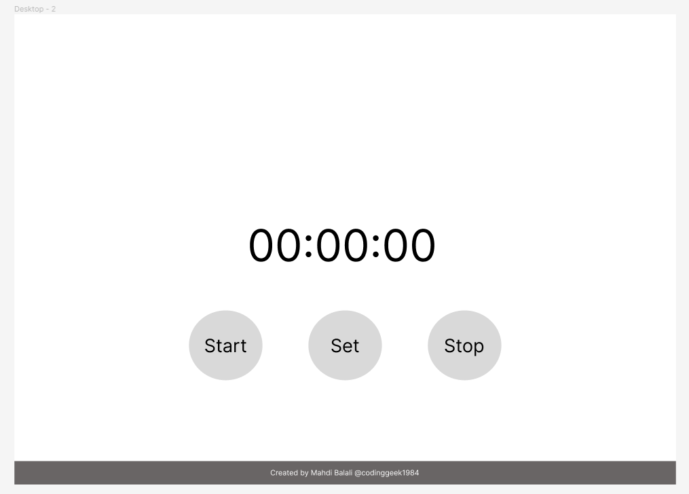
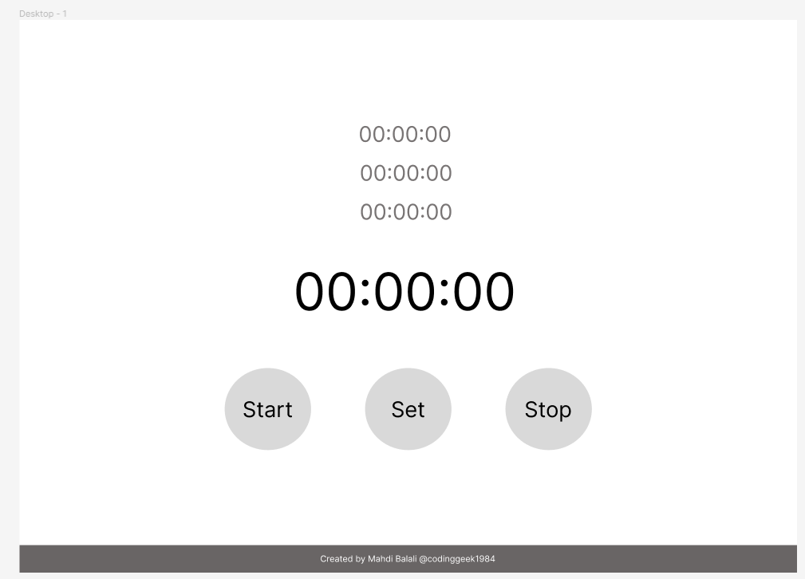
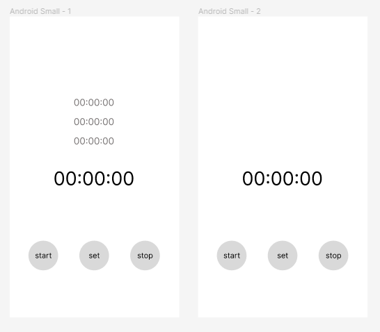
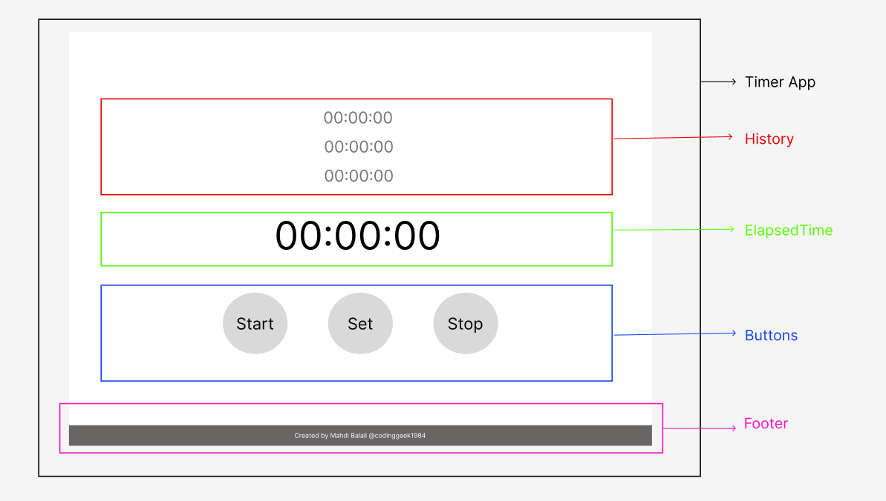

# Counter

## Introduction
My goal by developing this program is to improve my skills and mastering in React. The idea is from the weblog article 
"50+ Beginner and Intermediate level React Project Ideas" by R. Fulzele published at [Medium](https://medium.com/). You can find the paper [here](https://medium.com/@rohan.fulzele/50-beginner-and-intermediate-level-react-project-ideas-%EF%B8%8F-809b396faa39).
The program description is very simple:

> 2. Counter App: Build a counter application that increments or decrements a value when buttons are clicked.

I will keep it simple, as it is, to concentrate more on React implementation. I will also track the famous article published by React Official, [**Thinking in React**. ](https://react.dev/learn/thinking-in-react). Actually, the project plan is designed just the same as the steps provided in this paper.

## Project Plan
1. Create wireframe in figma
2. Break the UI into a component hierarchy
3. Build a static version in React
4. Find the minimal but complete representation of UI state
5. Identify where your state should live
6. Add inverse data flow
7. Make it Responsive
8. Test
9. Publish

## Project Wire-frame:
I have create a very simple wireframe for my counter app. you can see it designed for desktop and small android cell phone in the following images:

## Break the UI into a component hierarchy
I just breaked down the UI which I just designed in Figma, to components, based on their rolte in the program. The schematic is provided in the following image:

The five components designed, are as follows:
1. Counter App, contains the entire App.
2. History, shows the set times
3. Elapsed time, is the main section of the UI, showing the elapsed time since the user clicked start.
4. Buttons, includes the buttons of the app, and will manage their functionality.
5. Footer is a static section, showing the copyright details of the app.

## Build a static version in React
Now, according to the [Thinking in React](https://react.dev/learn/thinking-in-react) paper, I will create a static version of the app, including the mentioned components in the previous section.

## Getting Started with Create React App

This project was bootstrapped with [Create React App](https://github.com/facebook/create-react-app).

### Available Scripts

In the project directory, you can run:

### `npm start`

Runs the app in the development mode.\
Open [http://localhost:3000](http://localhost:3000) to view it in your browser.

The page will reload when you make changes.\
You may also see any lint errors in the console.

### `npm test`

Launches the test runner in the interactive watch mode.\
See the section about [running tests](https://facebook.github.io/create-react-app/docs/running-tests) for more information.

### `npm run build`

Builds the app for production to the `build` folder.\
It correctly bundles React in production mode and optimizes the build for the best performance.

The build is minified and the filenames include the hashes.\
Your app is ready to be deployed!

See the section about [deployment](https://facebook.github.io/create-react-app/docs/deployment) for more information.

### `npm run eject`

**Note: this is a one-way operation. Once you `eject`, you can't go back!**

If you aren't satisfied with the build tool and configuration choices, you can `eject` at any time. This command will remove the single build dependency from your project.

Instead, it will copy all the configuration files and the transitive dependencies (webpack, Babel, ESLint, etc) right into your project so you have full control over them. All of the commands except `eject` will still work, but they will point to the copied scripts so you can tweak them. At this point you're on your own.

You don't have to ever use `eject`. The curated feature set is suitable for small and middle deployments, and you shouldn't feel obligated to use this feature. However we understand that this tool wouldn't be useful if you couldn't customize it when you are ready for it.

### Learn More

You can learn more in the [Create React App documentation](https://facebook.github.io/create-react-app/docs/getting-started).

To learn React, check out the [React documentation](https://reactjs.org/).

#### Code Splitting

This section has moved here: [https://facebook.github.io/create-react-app/docs/code-splitting](https://facebook.github.io/create-react-app/docs/code-splitting)

#### Analyzing the Bundle Size

This section has moved here: [https://facebook.github.io/create-react-app/docs/analyzing-the-bundle-size](https://facebook.github.io/create-react-app/docs/analyzing-the-bundle-size)

#### Making a Progressive Web App

This section has moved here: [https://facebook.github.io/create-react-app/docs/making-a-progressive-web-app](https://facebook.github.io/create-react-app/docs/making-a-progressive-web-app)

#### Advanced Configuration

This section has moved here: [https://facebook.github.io/create-react-app/docs/advanced-configuration](https://facebook.github.io/create-react-app/docs/advanced-configuration)

#### Deployment

This section has moved here: [https://facebook.github.io/create-react-app/docs/deployment](https://facebook.github.io/create-react-app/docs/deployment)

#### `npm run build` fails to minify

This section has moved here: [https://facebook.github.io/create-react-app/docs/troubleshooting#npm-run-build-fails-to-minify](https://facebook.github.io/create-react-app/docs/troubleshooting#npm-run-build-fails-to-minify)
